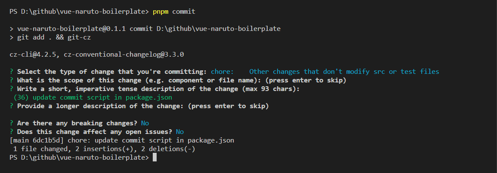
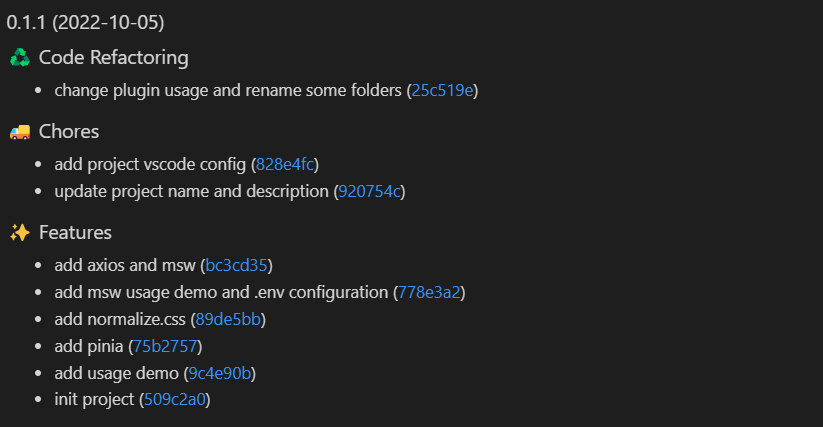

# Vue Naruto Boilerplate

> A lightweight enterprise boilerplate with Vue 2.7 for developer.

## Getting Started

```
# 1. Clone repository.
git clone https://github.com/Fujihai/vue-naruto-boilerplate.git local-project-name

# 2. Enter local-project folder.
cd local-project-name/

# 3. Install dependencies.
pnpm i

# 4. Run project with development mode. Switch to mock mode, use `pnpm serve-mock`.
pnpm serve
```

## Features

### Standard commit message

Use `pnpm commit`.



### Change log

Use `pnpm release`.



## Documentations

* [file structure](docs/file-structure.md)
